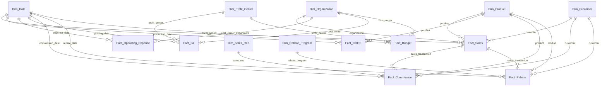

# Enterprise Profitability Data Model

## 1. Modeling Approach

Use a **star-schema / fact-and-dimension model** centered on profitability reporting.

The attached base model already contains the main subject areas required for the use case: sales/revenue, COGS, product, customer, organization, profit center, operating expense, general ledger, budget/forecast, and date.

The model below keeps those tables and organizes them around consistent business dimensions.

---

## 2. Recommended Fact Tables

### Fact_Sales
**Grain:** One invoice line / sales transaction.

**Keys**
- Transaction_ID
- Order_ID
- Invoice_ID
- Invoice_Line_ID
- Transaction_Date
- Posting_Date
- Customer_ID
- Product_ID
- Region_ID
- Business_Unit
- Sales_Org
- Currency_Code

**Measures**
- Quantity_Sold
- Gross_Sales_Amount
- Discount_Amount
- Net_Sales_Amount
- Returns_Amount
- Rebate_Amount
- Freight_Revenue
- Tax_Amount
- COGS_Amount

**Supports:** Revenue, customer profitability, product profitability, regional profitability, discounts, rebates, and freight revenue.

### Fact_COGS
**Grain:** Product/material cost transaction by plant and production date.

**Keys / Attributes**
- Transaction_ID
- Product_ID
- Plant_ID
- Material_ID
- Production_Date

**Measures**
- Standard_Cost
- Actual_Cost
- Material_Cost
- Labor_Cost
- Overhead_Cost
- Freight_Cost
- Manufacturing_Cost
- Cost_Per_Unit

**Supports:** Product cost, manufacturing cost, cost variance, and unit-cost analysis.

### Fact_Operating_Expense
**Grain:** Operating expense transaction.

**Keys / Attributes**
- Expense_ID
- GL_Account
- Cost_Center
- Department
- Expense_Date
- Expense_Type
- Expense_Category

**Measure**
- Expense_Amount

**Supports:** SG&A, marketing, sales, administrative, and operating-expense analysis.

### Fact_GL
**Grain:** General-ledger journal posting.

**Keys / Attributes**
- Journal_ID
- Posting_Date
- GL_Account
- Account_Type
- Cost_Center
- Profit_Center
- Fiscal_Period
- Fiscal_Year
- Currency

**Measure**
- Amount

**Supports:** Financial reconciliation, operating profit, EBITDA, and net profit reporting.

### Fact_Commission
**Grain:** Commission transaction by sales transaction / invoice line and sales representative.

**Keys / Attributes**
- Commission_ID
- Transaction_ID
- Invoice_Line_ID
- Sales_Rep_ID
- Customer_ID
- Product_ID
- Commission_Date
- Commission_Type

**Measures**
- Commission_Rate
- Commission_Amount

**Supports:** Commission impact analysis, sales-rep profitability, and contribution-margin analysis.

### Fact_Rebate
**Grain:** Rebate transaction by customer, product, rebate program, and applicable sales transaction.

**Keys / Attributes**
- Rebate_ID
- Transaction_ID
- Invoice_Line_ID
- Customer_ID
- Product_ID
- Rebate_Program_ID
- Rebate_Date
- Rebate_Type

**Measures**
- Rebate_Rate
- Rebate_Amount

**Supports:** Rebate effectiveness, customer profitability, product profitability, and contribution-margin analysis.

### Fact_Budget
**Grain:** Budget/forecast by fiscal period, cost center, and profit center.

**Keys**
- Fiscal_Year
- Fiscal_Period
- Cost_Center
- Profit_Center

**Measures**
- Budget_Revenue
- Budget_Cost
- Budget_Profit
- Forecast_Revenue
- Forecast_Cost

**Supports:** Budget vs actual, forecast vs actual, and profit variance.

---

## 3. Recommended Dimensions

### Dim_Date
Use as the common calendar dimension for all fact tables.

- Date_Key
- Date
- Day
- Week
- Month
- Quarter
- Year
- Fiscal_Period
- Fiscal_Quarter
- Fiscal_Year

### Dim_Product
- Product_ID
- Product_Code
- Product_Name
- Product_Category
- Product_Subcategory
- Brand
- SKU
- Product_Line
- Launch_Date
- Discontinued_Flag

### Dim_Customer
- Customer_ID
- Customer_Name
- Customer_Type
- Customer_Segment
- Industry
- Sales_Region
- Country
- State
- City
- Parent_Customer
- Account_Manager

### Dim_Organization
- Business_Unit
- Division
- Department
- Cost_Center
- Profit_Center
- Sales_Org
- Region
- Country

### Dim_Profit_Center
- Profit_Center_ID
- Profit_Center_Name
- Business_Unit
- Division
- Manager

### Dim_Sales_Rep
- Sales_Rep_ID
- Sales_Rep_Name
- Sales_Team
- Sales_Manager
- Region
- Business_Unit

### Dim_Rebate_Program
- Rebate_Program_ID
- Rebate_Program_Name
- Rebate_Type
- Start_Date
- End_Date
- Status

---

## 4. Recommended Relationships

---

## 5. Profitability Reporting Layer

The reporting layer should derive profitability measures from the fact tables rather than storing every calculated KPI as separate transactional data.

### Revenue
- Gross Revenue
- Net Revenue
- Discounts
- Returns
- Freight Revenue

### Sales Incentives
- Rebate Amount
- Rebate %
- Commission Amount
- Commission %

### Cost
- COGS
- Material Cost
- Labor Cost
- Overhead Cost
- Manufacturing Cost
- Freight Cost
- Operating Expense

### Profitability
- Gross Profit
- Gross Margin %
- Contribution Margin
- Contribution Margin %
- Operating Profit
- EBITDA
- Net Profit

For contribution-margin reporting, commission and rebate amounts should be included as profitability-impacting measures based on the business rules defined for the reporting solution.

### Planning
- Budget Revenue
- Budget Profit
- Actual vs Budget
- Actual vs Forecast
- Profit Variance

---

## 6. Reporting Paths

| Analysis | Primary Fact | Main Dimensions |
|---|---|---|
| Enterprise Profitability | Fact_GL / Fact_Sales | Date, Organization, Profit Center |
| Customer Profitability | Fact_Sales | Customer, Product, Date |
| Product Profitability | Fact_Sales + Fact_COGS | Product, Date |
| Regional Profitability | Fact_Sales | Organization/Region, Date |
| Commission Impact | Fact_Commission + Fact_Sales | Sales Rep, Customer, Product, Date |
| Rebate Effectiveness | Fact_Rebate + Fact_Sales | Rebate Program, Customer, Product, Date |
| Manufacturing Cost | Fact_COGS | Product, Date |
| Operating Expense | Fact_Operating_Expense | Organization, Date |
| Budget vs Actual | Fact_Budget + Fact_GL | Date, Organization, Profit Center |

---

## 7. Important Modeling Gap

The base model contains `Region_ID` in `Fact_Sales`, but it does **not** define a separate `Dim_Region` with a matching key. Before implementation, either:

1. map `Region_ID` to the regional attributes in `Dim_Organization`, or
2. create a dedicated `Dim_Region` if region is managed independently.

Do not create the relationship until the source-system key mapping is confirmed.

## 8. Final Model

The recommended core model is:

**Facts:**  
`Fact_Sales`, `Fact_COGS`, `Fact_Operating_Expense`, `Fact_GL`, `Fact_Commission`, `Fact_Rebate`, `Fact_Budget`

**Dimensions:**  
`Dim_Date`, `Dim_Product`, `Dim_Customer`, `Dim_Organization`, `Dim_Profit_Center`, `Dim_Sales_Rep`, `Dim_Rebate_Program`

This structure supports the profitability use case while keeping sales, cost, expense, financial, and planning data at their appropriate grains.
